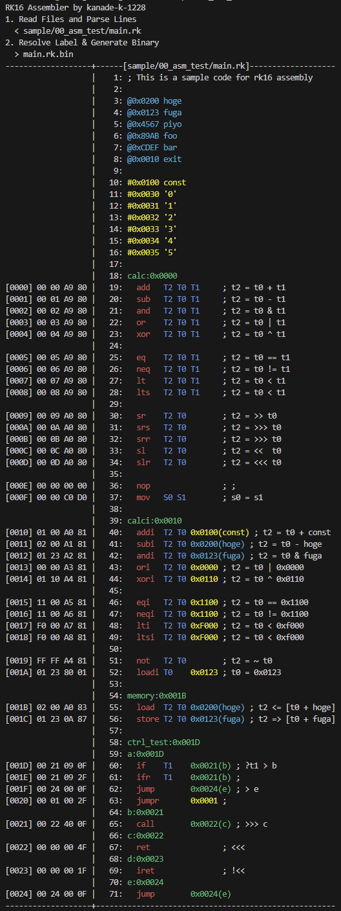

# CraftCore: Learn the fundamentals of computers

CraftCore is a project to build a CPU with standard logic IC's, and run custom OS on it.

- **Simple**: We keep it simple instead of going for optimization, so it's easy to implement.
- **Sufficient**: Our computer has sufficient functionality to run various programs.

## Archtecture: RK16

RK16 is a simple RISC ISA.

## Assembler: rkasm

## Emulator: rkemu

## RKOS: Real Time OS for RK16

## Tutorial

### Install

```
$ cargo install --path asm
$ cargo install --path emu
```

### Assemble

```
$ rkasm -d sample/00_asm_test/main.rk
```



Left side is the output binary, right side is the assembly code.

## Test

```
cargo test
cargo llvm-cov --html
```
